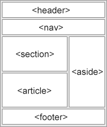
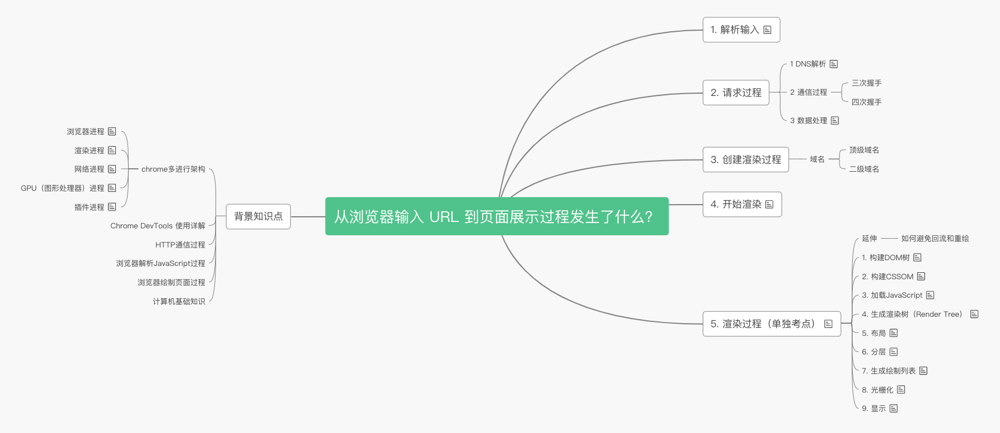

# HTML  问题答案

> 下面所有的代码都是个人作答，可能存在理解错误或者答案错误的地方，欢迎大家在[项目下方](https://github.com/springHyc/InterviewLibrary)或者[项目的 issues](https://github.com/springHyc/InterviewLibrary/issues)中留言指正。

## 1. 下面代码中，在浏览器上显示为什么会有空格？

```html
<div>
  <span>1</span>
  <span>2</span>
  <span>3</span>
</div>
```

显示结果：`1 2 3`，为什么会有空格 ?

- 原因：

  > 行内元素之间产生的间距，是由于换行符、tab( 制表符 )、空格等字符引起，而字符的大小是定义字体大小来控制。（不论空格、换行符、tab 有几个，都显示一个空格）

  三个`span`标签之间都有换行符，而 “ 行内元素之间的空格相当于块级元素的回车换行
  ” 所以会在输出时，显示空格。

- 解决办法

  1. 可以使用浮动来去除空格。

  > 不可否认，使用浮动技术是比较好的办法，实际工作中我们使用浮动也是比较多，但是也并不是每处地方都要使用浮动，而且使用浮动后还需要清除浮动的操作。

  ```html
    <div>
      <span>1</span>
      <span>2</span>
      <span>3</span>
    </div>

    <style>
      span {
        float: left;
    }
  </style>
  ```

  2. 由于 “ 行内元素之间产生的间距，是由于换行符、tab( 制表符 )、空格等字符引起，而<u>字符的大小是定义字体大小来控制</u>。” 所以我们可以控制父级元素的字符大小来去除空格。

```html
    <div>
      <span>1</span>
      <span>2</span>
      <span>3</span>
  </div>

  <style>
    div{
      font-size: 0; /* 所有浏览器 */
      *word-spacing:-1px;/* 使用word-spacing 修复 IE6、7 中始终存在的 1px 空隙，减少单词间的空白（即字间隔） */
    }
    span {
      font-size: 16;
      letter-spacing: normal;/* 设置字母、字间距为0 */
      word-spacing: normal; /* 设置单词、字段间距为0 */
    }
</style>
```

经过测试后，可发现设置 font-size:0 并不能使得换行符、tab( 制表符 )、空格等在所有浏览器中产生的额外间距消失：IE6 、 7 浏览器始终存在的 1px 空隙。

针对 IE6、7 浏览器，使用 word-spacing 修复 IE6、7 中始终存在的 1px 空隙，减少 单词间的空白（即字间隔 `*word-spacing:-1px;`

- 相关：

> 行内元素的高度由其内容撑开，**不可显示的设置其高度**，这就是为什么我们一次次的在 span 上设置 height 属性不好使的原因。

## 2. HTML 语义化是什么？

就是写出的代码符合内容的结构话（内容语义化），选择合适的标签（代码语义化）能够便于开发者阅读和写出更优雅的代码的同时能让浏览器的爬虫和机器很好的解析。

## 3. 为什么要进行 HTML 的语义化？

## 4. 写 HTML 代码时应注意什么？

- 尽可能少的使用无语义的标签。例如`div`,`span`
- 在语义不明显时，既可以使用`div`又可以使用`P`的时候，尽量使用`P`，因为`P`在默认情况下有上下间距，对兼容特殊终端有利
- 不要使用纯样式标签，例如：`b,font,u`, 该用 CSS 设置
- 需要强调的文本，可以包含在 strong 或 em 标签中（浏览器预设样式，能用 CSS 指定就不用它们）， strong 默认样式是加粗（不要用 b）， em 是斜体（不用 i）
- 使用表格时，标题要用 caption，表头用 thead，主体部分用 tbody 包围，尾部用
  tfoot 包围。表头和一般单元格要区分开，表头用 th，单元格用 td
- 表单域要用 fieldset 标签包起来，并用 legend 标签说明表单的用途
- 每个 input 标签对应的说明文本都需要使用 label 标签，并且通过为 input 设置 id
  属性，在 lable 标签中设置 for=someld 来让说明文本和相对应的 input 关联起来

> 备注 :
> [HTML5 语义元素](https://www.w3cschool.cn/html5/html5-semantic-elements.html)

## 5. 块级元素有哪些？

- div
- p
- H1
- H2
- H3
- H4
- H5
- H6
- form
- ul

## 6. 行内元素有哪些？

- span
- a
- b
- br
- i
- input

## 7. 行内块级元素有哪些？

- img
- input
- button
- texterea
- label

## 8. 行内元素和块级元素的具体区别是什么？行内元素的 padding 和 margin 可以设置吗？

行内元素:

- 和相邻的内联元素在同一行；
- width\height\padding-bottom\padding-bottom 和 margin-top\margin-bottom 都不可改变（也就是 padding 和 margin 的 left 和 right 是可以改变的）
- 宽度只与内容有关；
- 行内元素只能容纳文本或其他行内元素。

块级元素

- 总是在新的一行上开始，占据一整行，而且后面的元素也会另起一行显示；
- width\height\padding\margin 都可控制；
- 宽度始终与浏览器宽度一致，与内容无关；
- 它可以容纳内联元素和其他块元素。

### 块级元素的特性

- 总是在新行上开始，占据一整行，而且其后的元素也会另起一行显示
- 宽度 (width)、高度 (height)、内边距 (padding) 和外边距 (margin) 都可控制
- 宽带始终是与浏览器宽度一样，与内容无关
- 它可以容纳内联元素和其他块元素

### 行内元素的特性

- 和相邻的内联元素在同一行
- 宽度 (width)、高度 (height)、内边距的 top/bottom(padding-top/padding-bottom)
  和外边距的 top/bottom(margin-top/margin-bottom) 都不可改变（也就是 padding 和
  margin 的 left 和 right 是可以设置的），就是里面文字或图片的大小
- 宽度只与内容有关
- 行内元素只能容纳文本或者其他行内元素

## 9. 那么问题来了，浏览器还有默认的天生 inline-block 元素（拥有内在尺寸，可设置高宽，但不会自动换行），有哪些？( 行内块级元素 )

- `<input>`
- ``
- `<button>`
- `<texterea>`
- `<label>`

## 10 每个 HTML 文件里开头都有个很重要的东西，`DOCTYPE`，这是做什么的？

`<DOCTYPE>`声明位于文档中最前面的位置，处于`<html>`标签之前。他是标准通用标记语言的文档类型声明，有助于在浏览器中正确的显示网页。此标签可以告知浏览器文档使用哪种类型的 HTML 或 XHTML 规范。

**重点就是，告诉浏览器按照何种规范来解析页面。**

## 11. get 和 post 的区别？

> 要本质的东西，不要说 API 使用上的区别

GET 和 POST 本质上就是 TCP 链接，并无差别。但是由于 HTTP 的规定和浏览器/服务器的限制，导致他们在应用过程中体现出一些不同。 GET 和 POST 还有一个重大区别，简单的说：GET 产生一个 TCP 数据包；POST 产生两个 TCP 数据包。对于 GET 方式的请求，浏览器会把 http header 和 data 一并发送出去，服务器响应 200（返回数据）； 而对于 POST，浏览器先发送 header，服务器响应 100 continue，浏览器再发送 data，服务器响应 200 ok（返回数据）。 但是，比如你想在 GET 请求里带 body，一样可以发送 Expect: 100-continue 并等待 100 continue，这是符合标准的。

作者：杨光链接：https://www.zhihu.com/question/28586791/answer/145424285
来源：知乎著作权归作者所有。商业转载请联系作者获得授权，非商业转载请注明出处。

从前端的常规使用来说，由于服务器和浏览器的限制，出现了一些不同之处：

- GET 在浏览器回退时是无害的，而 POST 会再次提交请求。
- GET 产生的 URL 地址可以被书签收藏，而 POST 不可
- GET 请求会被浏览器主动 cache，而 POST 不会，除非手动设置。
- GET 请求只能进行 url 编码，而 POST 支持多种编码方式。
- GET 请求参数会被完整保留在浏览器历史记录里，而 POST 中的参数不会被保留。
- GET 请求在 URL 中传送的参数是有长度限制的(大多数浏览器限制在 2K，大多数服务器在 64K 左右)，而 POST 么有。
- 对参数的数据类型，GET 只接受 ASCII 字符，而 POST 没有限制。
- GET 比 POST 更不安全，因为参数直接暴露在 URL 上，所以不能用来传递敏感信息。
- GET 参数通过 URL 传递，POST 放在 Request body 中。

> [这个解释很棒](https://mp.weixin.qq.com/s?__biz=MzI3NzIzMzg3Mw==&mid=100000054&idx=1&sn=71f6c214f3833d9ca20b9f7dcd9d33e4#rd)

## 12. 什么是同源策略？跨域有哪些解决方案？什么是跨域？

### 什么是跨域？

浏览器从一个域名的网页去请求另一个域名的资源时，域名、端口、协议任一不同，都是跨域。

> 一级域名和二级域名：
> 在完整的域名中，最右一个“.”的右边部分称为顶级域名或一级域名。
> 含二级域名的“二级域名.顶级域名”这样的结构一起称为“二级域名，以此类推。所提及的“域名”都为整个字符串。
> 例如： yahoo.com.cn 中，
> com、cn 都是顶级域名（参见通用顶级域名概念）。
> yahoo 为三级域名。
> com 为二级域名。
> cn 为顶级域名或一级域名。
> 每一级域名控制它下一级的域名分配。例如，顶级域名 cn 下定义了 com.cn 、net.cn 和 org.cn 。（注：com、net、org 也称为顶级域名（参见通用顶级域名概念），或二级域名。）

- 域名不同

  ```js
  // 主域名不同
  http://www.baidu.com/index.html
  http://www.sina.com/test.js
  // 子域名不同
  http://www.666.baidu.com/index.html
  http://www.555.baidu.com/test.js

  // 域名或域名IP
  http://www.baidu.com/index.html
  http://180.149.132.47/test.js
  ```

- 端口不同

  ```js
  http://www.baidu.com:8080/index.html
  http://www.baidu.com:8081/test.js
  ```

- 协议不同

  ```js
  http://www.baidu.com:8080/index.html
  https://www.baidu.com:8080/test.js
  ```

### 跨域的解决方案

- 通过 JSONP 跨域
  填充式 json。类似往页面添加一个 script 标签，通过 src 属性去触发对指定地址的请求,故只能是 Get 请求
- 代理
  通过后端去调用。
  www.baidu.com/index.html 需要调用 www.sina.com/server.php，可以写一个接口 www.baidu.com/server.php，由这个接口在后端去调用 www.sina.com/server.php 并拿到返回值，然后再返回给 index.html

* PHP 端修改 header
  header(‘Access-Control-Allow-Origin:\*’);//允许所有来源访问
  header(‘Access-Control-Allow-Method:POST,GET’);//允许访问的方式
* documen.domian
  document.domian 可以解决不同 window 之间不能进行交互的操作。只适用于主域相同，子域不相同的情况。

## 16. http 和 https 的区别？对 https 有什么了解？

### HTTP

超文本传输协议 HTTP 协议被用于在 Web 浏览器和网站服务器之间传递信息。HTTP 协议以明文方式发送内容，不提供任何方式的数据加密，如果攻击者截取了 Web 浏览器和网站服务器之间的传输报文，就可以直接读懂其中的信息，因此 HTTP 协议不适合传输一些敏感信息，比如信用卡号、密码等。

### HTTPS

https 是比 http 更加安全的网络协议，可以说 HTTPS = HTTP + SSL。HTTPS 是在 HTTP 下加入 SSL 层，HTTPS 的安全基础是 SSL，因此加密的详细内容就需要 SSL。

### 二者区别

- http 工作于应用层,是超文本传输协议，信息是明文传输，https 工作在传输层,是具有安全性的 ssl 加密传输协议。
- http 和 https 使用的是完全不同的连接方式，用的端口也不一样，前者是 80，后者是 443。
- http 的连接很简单，是无状态的；HTTPS 协议是由 SSL+HTTP 协议构建的可进行加密传输、身份认证的网络协议，比 http 协议安全。
- HTTP 无需证书，而 HTTPS 需要 CA 机构 wosign 的颁发的 SSL 证书

## 13. 一个原生的`<input>`标签都有些什么事件？在浏览器上 onchange 什么时候触发？

### onchange 是怎么触发的？

当 input 捕获到焦点后，系统储存当前值，当 input 焦点离开后，判断当前值与之前存储的值是否不等，如果为 true 则触发 onchange 事件。非 ie 敲回车也可以实现触发

## 14. 原生的变化如何监听？怎么知道 input 框的值是改变了？

在`<input>`上添加一个属性`defaultValue`,用来做对比，或者将原始值记录下来。

## 15. html 原生事件

### Keyboard 事件

| 属性       | 值     | 描述                   |
| ---------- | ------ | ---------------------- |
| onkeydown  | script | 在用户按下按键时触发。 |
| onkeypress | script | 在用户敲击按钮时触发。 |
| onkeyup    | script | 当用户释放按键时触发。 |

### Mouse 事件

| 属性         | 值     | 描述                                           |
| ------------ | ------ | ---------------------------------------------- |
| onclick      | script | 元素上发生鼠标点击时触发。                     |
| ondblclick   | script | 元素上发生鼠标双击时触发。                     |
| ondrag       | script | 元素被拖动时运行的脚本。                       |
| ondragend    | script | 在拖动操作末端运行的脚本。                     |
| ondragenter  | script | 当元素元素已被拖动到有效拖放区域时运行的脚本。 |
| ondragleave  | script | 当元素离开有效拖放目标时运行的脚本。           |
| ondragover   | script | 当元素在有效拖放目标上正在被拖动时运行的脚本。 |
| ondragstart  | script | 在拖动操作开端运行的脚本。                     |
| ondrop       | script | 当被拖元素正在被拖放时运行的脚本。             |
| onmousedown  | script | 当元素上按下鼠标按钮时触发。                   |
| onmousemove  | script | 当鼠标指针移动到元素上时触发。                 |
| onmouseout   | script | 当鼠标指针移出元素时触发。                     |
| onmouseover  | script | 当鼠标指针移动到元素上时触发。                 |
| onmouseup    | script | 当在元素上释放鼠标按钮时触发。                 |
| onmousewheel | script | 当鼠标滚轮正在被滚动时运行的脚本。             |
| onscroll     | script | 当元素滚动条被滚动时运行的脚本。               |

## 17. http 缓存的原理，怎么进行的？

缓存缓存，就是把需要的东西存起来，不需要每次都去请求。主要目的减小服务器压力，放到客户端上来讲，还利于节省流量，还能流畅的把 UI 显示出来，提高了用户体验。对于 Http 缓存来讲，主要的就是校验缓存的有效性，也就是新鲜度。

缓存机制有：强制缓存和对比缓存。

请求流程 1：


请求流程 2：


## 18. CDN 了解吗？

内容分发网络。CDN 系统能够实时地根据网络流量和各节点的连接、负载状况以及到用户的距离和响应时间等综合信息将用户的请求重新导向离用户最近的服务节点上。其目的是使用户可就近取得所需内容，解决 Internet 网络拥挤的状况，提高用户访问网站的响应速度。

## 19. HTML5 的新特性（或者说 HTML5 有代表性的标签）

### HTML5 提供了新的元素来创建更好的页面结构：

| 标签       | 描述                              |
| ---------- | --------------------------------- |
| <article>  | 定义页面独立的内容区域。          |
| <aside>    | 定义页面的侧边栏内容。            |
| <header>   | 定义了文档的头部区域              |
| <footer>   | 定义 section 或 document 的页脚。 |
| <mark>     | 定义带有记号的文本。              |
| <nav>      | 定义导航链接的部分。              |
| <progress> | 定义任何类型的任务的进度。        |
| <time>     | 定义日期或时间。                  |

### HTML5 Canvas

HTML5 <canvas> 元素用于图形的绘制，通过脚本 (通常是 JavaScript)来完成.

<canvas> 标签只是图形容器，您必须使用脚本来绘制图形。

### HTML5 拖放

``

### HTML5 地理定位

Geolocation API 用于获得用户的地理位置。

### HTML5 Audio(音频)、Video(视频)

### HTML5 语义元素



### HTML5 Web 存储

- localStorage
- sessionStorage

> [参考](https://blog.csdn.net/chandoudeyuyi/article/details/69206236)

## 20. 写一个选择器，完成从 DOM 中获取所有`<a>`中包含`163.com`的链接筛选出来。

> 其实考察的是如何自己实现`$`符号，使用的是`document.queryElementAll(a[href*=163.com])`。这个很可能是不对的。

## 21. 从浏览器输入 URL 到页面展示过程发生了什么？（包含浏览器是如何渲染页面的？）

> 我想大家都或多或少能说出一二。但是，其实这个问题很有深度，而你是否回答的有深度，在很大程度上会影响到面试官对你的印象。
> 要扩展自己的基础知识！要有广度和深度！

[答案详解](https://segmentfault.com/a/1190000022262262?utm_source=weekly&utm_medium=email&utm_campaign=SegmentFault%20%E7%B2%BE%E9%80%89%E6%AF%8F%E5%91%A8%E7%B2%BE%E9%80%89%E4%B8%A8%E5%B0%8F%E7%A8%8B%E5%BA%8F%E6%A1%86%E6%9E%B6%E8%BF%90%E8%A1%8C%E6%97%B6%E6%80%A7%E8%83%BD%E5%A4%A7%E6%B5%8B%E8%AF%84%E4%B8%A8%E5%89%8D%E7%AB%AF%E6%80%A7%E8%83%BD%E4%BC%98%E5%8C%96%2024%20%E6%9D%A1%E5%BB%BA%E8%AE%AE)



## 22. 浏览器是如何渲染页面的

渲染过程，是整个从理器输入 URL 到页面渲染过程的最后一步。而页面渲染的过程可以分为 9 个步骤：

1. 解析 HTML 生成 DOM 树
2. 解析 CSS 生成 CSSOM
3. 加载或执行 JavaScript
4. 生成渲染树（Render Tree）
5. 布局
6. 分层
7. 生成绘制列表
8. 光栅化
9. 显示