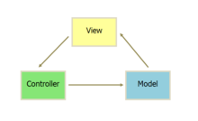

# 项目经验的问题答案

> 下面所有的代码都是个人作答，可能存在理解错误或者答案错误的地方，欢迎大家在[项目下方](https://github.com/springHyc/InterviewLibrary)或者[项目的 issues](https://github.com/springHyc/InterviewLibrary/issues)中留言指正。

## 1. angular 和 react(react-native) 的区别？

> react-native 是把 react 那一套的底层换成 ios 和 Android app 的底层，让你能用开发网页的方法来开发原生 APP。

-   从库的大小上来说，angularjs 属于重量级的，而 react 和 react-native 都属于轻量级的。
-   从数据处理方面来说，angularjs 是双向绑定的双向数据流方式，也会带来性能问题，angular 的实现方法叫做“Dirty-checking”（脏检查机制），也就是通过跟踪数据的改变再动态更新 UI 界面。所以意味着在 angular 的作用域中任何操作的执行都会引发 Dirty-checking，随着绑定数量的增加性能就会降低；而 react 和 react-native 是单向绑定的单向数据流方式。
-   从操作 DOM 方面来讲，angular 过于依赖 DOM，angular 在执行过程中会先扫描所有的 DOM，然后通过指令来编译（angular 是直接操作 DOM）。这会造成一个结果，就是很难去判断程序的执行顺序导致很难进行调试；react 是有一个“虚拟 DOM”,并不直接对 DOM 进行操作，在页面渲染的过程中，react 通过虚拟 DOM 中的微操作来实现对实际 DOM 的局部更新。
-   从组件化的角度来说，angular1.x 没有大规模的组件形式，angular2 才是大规模的组件化的形式；react && react-native 是可以编写独立的 UI 组件。
-   从描述 UI 外观方面来说,angular 使用的就是 html，react 使用的是 jsx,jsx 是 JavaScript 的语法扩展，通过 Java 实现的类 XML 语言。jsx 不遵循内容与逻辑分离的传统方法。但是它有一个明显的又是：静态分析。如果 jsx 标记中有错误，编辑器会报错，这个能帮助我们立即发现拼写错误和其他一个愚蠢的错误。
-   从新手入门学习的成本方面来说，angular 的学习成本比 react&&react-native 更大些。angular 要了解更多的概念：type、模块、依赖注入、装饰器、组件、服务、管道、模板和指令以及高级一些的如 RxJs;而 react&&react-native 来说，我们需要了解的概念有：jsx、组件，高级一些的有 redux。

react 相比 angular 的优点：

-   react 的性能很好，虚拟 DOM，不直接对 DOM 进行操作，可以满足实际生产环境下绝大部分的性能要求。
-   从使用者的角度来说，是非常轻量级的。很容易和其他顺手的工具搭配使用。而 angular 是重量级，里面的一些部分是直接继承在 angular 的源码中的，比如路由导航部分。

-   angular 比较重量级，多一些开箱即用的特性，而 react 的特性不多，可以根据自己的需求去选择合适的第三方库。

-   React 快速的原因之一就是 React 很少直接操作 DOM，浏览器时间也一样，原因是太多的浏览器时间会占用很大的内存。
-   React 本身只是 view 层，它提供了一套编写 DOM 组件的工具，提出了 virtual dom(虚拟 DOM)这种新颖的思路，并且衍生出了 react native.

## 2. 单项数据流和双向数据流区别？

> 经常看见在 vue 或者 angular 的介绍里说自己的特色是双向数据绑定，而在看 react 的介绍中，说自己的优势和特色是单向数据绑定。 这两个截然不同的机制，为什么又都能自圆其说呢？在同一个时代里怎么建立统一的理解？还是说两种机制有各自适合的最佳场景？

一般来说，非 UI 控件不存在双向的，只有单向数据流。UI 控件才有双向的数据流问题。

单项绑定使得数据流也是单向的，对于复杂应用来说这是实施统一的状态管理（如 redux）的前提。

双向绑定在一些需要实时反应用户输入的场合会非常方便（eg. 多级联动菜单）。但通常认为复杂应用中这种便利比不上引入状态管理带来的优势。

## 二者的差异

### 原理

**双向数据绑定和单向数据绑定的差异在于：双向数据绑定是把数据变更的操作隐藏的框架内部，调用者并不会直接感知。**

单向绑定相对应的似的数据流也是单向的，而在践行单向数据流的 flux 的设计框架（redux 是其一个具体实现）中实现中，其实不过是在全局搞了一个单例的事件分发器（dispatcher）,开发者必须显示的通过这个统一的时间机制来做数据变更通知。

其实这种方式跟框架对 UI 控件上实现双向绑定的方式是一样的。**底层都是事件机制**。

> 假设在双向绑定的应用中，我们有办法 hack 进框架对 UI 控件 自动绑定的事件 listener 或 数据 watcher，然后加上类似 dispatcher 的逻辑，双向绑定背后的状态变化我们一样可以管理起来，一样可以享用单向数据流才有的收益。

> 单向绑定中如果我们做进一步的封装，把 action 和 dispatcher 都隐藏在框架内部，最后就变成。如果再进一步，把相互手动通知机制再隐藏起来，就变成sx

其实单双向绑定在一定程度上来说是可以转化的。只不过是框架封装程度上的差异，本质是可以相互转化的。

### 优缺点

#### 单向绑定

##### 优点

-   单向绑定可以相应的带来单向数据流，这样的好处是所有的状态变化都是可以被记录、跟踪，状态变化通过手动调用通知，源头易追溯，没有“暗箱操作”。
-   组件数据只有唯一的入口和出口，使得程序更加直观更容易理解，有利于应用的可维护性。

##### 缺点

-   代码量会相应的上升，数据的流转过程变长，从而出现很多类似的样板代码。
-   由于对应用状态独立管理的严格要求（单一的全局 store）,在处理局部状态较多的场景时，会显得啰嗦以及繁琐。

#### 双向绑定

##### 优点

-   在表单交互较多的情况下，会简化大量业务无关的代码。

##### 缺点

-   由于都是“暗箱操作”，我们无法追踪局部状态的变化（虽然大部分情况下我们并不关心），潜在的行为太多也增加了出错时 debug 的难度。
-   由于组件数据变化来源入口变的可能不止一个，新手很容易将数据流转方向弄的紊乱，如果再缺乏一些“管制”手段，最后就很容易一处错误操作造成应用雪崩。

### 适用场景

由以上的优缺点，我们可以得出单向绑定和双向绑定在功能上基本是互补的。

在 UI 控件中（通常是类表单操作），我们会使用双向的方式绑定数据；而其他场景则统一采用单向的方式构建应用。

## 3. ng 和 react 的脚手架有什么？

### angular 的脚手架

-   Visual Studio Code
-   angular-cli
-   ionic-cli
-   tyscript

### react-native 的脚手架

-   Visual Studio Code
-   Prettier
-   EditorConfig
-   ESlint
-   Flow
-   jest
-   react devtools
-   reactotron
-   remote-redux-devtools
-   redux
-   redux-saga
-   reselect
-   react-navigation
-   apisauce

## 4. ReactNative 中调用手机的相机，是怎么个调用，是 rn -> react -> 原生，还是 rn->原生? JSBridge 用过吗？

## 5. ReactNative 中 APP 的自动更新？有两种方式。

## 6. 为什么从 angular 转到 react-native 架构？

## 7. 遇到的 react-native 本身的性能问题有什么？

-   android 不支持 zindex
-   一个组件报错，经常导致整个 APP 报错，不能运行

## 8. react 的生命周期，在哪个生命周期中设置 setState 不会引起重新渲染？

| 生命周期                  | 调用次数        | 能否使用 setSate() |
| ------------------------- | --------------- | ------------------ |
| getDefaultProps           | 1(全局调用一次) | 否                 |
| getInitialState           | 1               | 否                 |
| componentWillMount        | 1               | 是                 |
| render                    | >=1             | 否                 |
| componentDidMount         | 1               | 是                 |
| componentWillReceiveProps | >=0             | 是                 |
| shouldComponentUpdate     | >=0             | 否                 |
| componentWillUpdate       | >=0             | 否                 |
| componentDidUpdate        | >=0             | 否                 |
| componentWillUnmount      | 1               | 否                 |

## 9. react 项目中的`registerServiceWorker.js`文件是做什么的？

在生产中，我们注册一个服务工作者来从本地缓存服务资产。
这使得应用程序在以后的产品访问中加载速度更快，并使其具备离线功能。但是，这也意味着开发人员(和用户)将只看到在“N+1”访问页面时部署的更新，因为以前缓存的资源在后台更新。

也就是实现 PWA。

## 10. 你知道 react-native 中的 contex 吗？为什么不推荐使用？

## 11. react-native 中父子组件传递参数的方式？

-   prop 传值
-   redux
-   DeviceEventEmitter 可以完成子组件向父组件传值

```js
componentDidMount() {
        //注意addListener的key和emit的key保持一致
        this.msgListener = DeviceEventEmitter.addListener('Msg',(listenerMsg) => {
            this.setState({
                listenerMsg:listenerMsg,
            })
        });

    }

     _postMsgByListener=()=>{
        DeviceEventEmitter.emit('Msg','此消息来自于子组件，DeviceEventEmitter父组件进行修改和状态变化');
    }
```

## 12. react-native 项目中，有的组件并没有用到 React 也需要写上`import React from 'react';`知道这是为什么吗？

你使用的‘react’文件 最后使用 `module.exports = React;`所以需要使用 import React from 'react';同时，把 jsx 编译到 js 需要调用一个函数, 这个函数在 React 叫 React.createElement.

## 15. react 核心架构是什么？react 的原理是什么？

### 核心架构

-   O(n) 复杂度的的 diff 算法。
    > 
    > React 通过 updateDepth 对 Virtual DOM 树进行层级控制，只会对相同颜色方框内的 DOM 节点进行比较，即同一个父节点下的所有子节点。当发现节点已经不存在，则该节点及其子节点会被完全删除掉，不会用于进一步的比较。这样只需要对树进行一次遍历，便能完成整个 DOM 树的比较。
    > [详细学习](https://blog.csdn.net/u011413061/article/details/77823299)
-   react 的生命周期
    
-   setState 实现机制

### react 的工作原理

react 引用了虚拟 DOM 的机制，在浏览器端用 Javascript 实现了一套 DOM API。。

虚拟 DOM 的原理：React 会在内存中维护一个虚拟 DOM 树，对这个树进行读或写，实际上是对虚拟 DOM 进行。当数据变化时，React 会自动更新虚拟 DOM，然后将新的虚拟 DOM 和旧的虚拟 DOM 进行对比，找到变更的部分，得出一个 diff，然后将 diff 放到一个队列里，最终批量更新这些 diff 到 DOM 中。

虚拟 DOM 的优点：

最终表现在 DOM 上的修改只是变更的部分，可以保证非常高效的渲染。

虚拟 DOM 的缺点：

首次渲染大量 DOM 时，由于多了一层虚拟 DOM 的计算，会比 innerHTML 插入慢。

### 16. 高阶函数是什么？高阶组件了解多少?

高阶函数的英文名叫 Higher-Order Function，熟悉 React 的朋友应该知道高阶组件 Higher-Order Component。没错，React 的高阶组件本质上就是高阶函数。

React 中高阶组件是一个普通的函数。接受一个组件作为参数，并且其返回值也为一个 react 组件。

其实，高阶组件的函数体的实现大部分都是“增强型组件”的实现，在实现中利用传递给高阶组件的参数定制化“增强型组件”的实现。

## 17. angular 中的异步与一般的异步事件有什么区别？

采用了队列机制。

## 18. angular 与 ionIC 的关系?

严格来说没什么关系，一个是 js 框架，一个是 UI 库。

而 Ionic 只是对 Angular 进行了扩展，利用 Angular 实现了很多符合移动端应用的组件，并搭建了很完善的样式库，是对 Angular 最成功的应用样例。即使不使用 Ionic，Angular 也可与任意样式库，如 Bootstrap、Foundation 等搭配使用，得到想要的页面效果。

## 20. 有没有用过 native 原生的东西？ react-native 怎么调 native 的文件服务？jsbridge 怎么使用？

WebViewJavascriptBridge 是移动 UIView 和 Html 交互通信的桥梁

## 21. react-native 是怎么运行起来的？React Native 是怎么在 Android /ios 上跑起来的？

怎么在 Android 上跑起来的

-   启动流程
-   通信机制
-   事件驱动
-   渲染原理
-   脚本执行

## 22. react-native 对于手机版本有要求吗?ios8 有什么特点吗？

-   Android >= 4.1 (API 16)
-   iOS >= 7.0

## 23. 你们用的版本 react 是什么版本？有关注过 16.0 有什么新特性吗？

最近使用的是 16.0 的版本。

16.0 的新特性有：

-   Components can now return arrays and strings from render.
-   Improved error handling with introduction of "error boundaries". Error boundaries are React components that catch JavaScript errors anywhere in their child component tree, log those errors, and display a fallback UI instead of the component tree that crashed.

    > 通过引入“错误边界”改进了错误处理。 错误边界是 React 组件，可以在其子组件树中的任何位置捕获 JavaScript 错误，记录这些错误并显示回退 UI，而不是崩溃的组件树。 - 翻译

    > 什么是 Error Boundaries?
    > 单一组件内部错误，不应该导致整个应用报错并显示空白页，而 Error Boundaries 解决的就是这个问题。
    > Error Boundaries 的实现
    > 需要在组件中定义个新的生命周期函数——componentDidCatch(error, info)

    ```js
    class ErrorBoundary extends React.Component {
        constructor(props) {
            super(props);
            this.state = { hasError: false };
        }

        componentDidCatch(error, info) {
            // Display fallback UI
            this.setState({ hasError: true });
            // You can also log the error to an error reporting service
            logErrorToMyService(error, info);
        }

        render() {
            if (this.state.hasError) {
                // You can render any custom fallback UI
                return <h1>Something went wrong.</h1>;
            }
            return this.props.children;
        }
    }

    // 上述的ErrorBoundary就是一个“错误边界”，然后我们可以这样来使用它：

    <ErrorBoundary>
        <MyWidget />
    </ErrorBoundary>;
    ```

    > Erro Boundaries 本质上也是一个组件，通过增加了新的生命周期函数 componentDidCatch 使其变成了一个新的组件，这个特殊组件可以捕获其子组件树中的 js 错误信息，输出错误信息或者在报错条件下，显示默认错误页。
    > **注意一个 Error Boundaries 只能捕获其子组件中的 js 错误，而不能捕获其组件本身的错误和非子组件中的 js 错误。**

## 24. 说一下 react 的生命周期;shouldUpdate 生命周期中有什么比较数据的好的方法吗？

生命周期图；

其中在 componentWillMount、componentDidMount 和 componentWillReceiveProps 三个生命周期中进行 setState 不会引起重新渲染。

shouldComponentUpdate 生命周期默认返回 true。
实际效果却是每个组件都完成 re-render 和 virtual-DOM diff 过程，虽然组件没有变更，这明显是一种浪费。react 的性能瓶颈主要表现在：对于 props 和 state 没有变化的组件，react 也要重新生成虚拟 DOM 及虚拟 DOM 的 diff。
这个时候，就是 shouldComponentUpdate 上场的时候了。该对齐进行优化。

优化主要有：

react 在发展的不同阶段提供两套官方方案：

-   PureRenderMin
-   PureComponent

### PureRenderMin

一种是基于 ES5 的 React.createClass 创建的组件，配合该形式下的 mixins 方式来组合 PureRenderMixin 提供的 shouldComponentUpdate 方法。当然用 ES6 创建的组件也能使用该方案。

```js
import PureRenderMixin from 'react-addons-pure-render-mixin';
class Example extends React.Component {
  constructor(props) {
    super(props);
    this.shouldComponentUpdate = PureRenderMixin.shouldComponentUpdate.bind(this);
}
```

### PureComponent

在 React 15.3.0 版本发布的针对 ES6 而增加的一个组件基类：React.PureComponent。这明显对 ES6 方式创建的组件更加友好。

```js
import React, { PureComponent } from 'react';
class Example extends PureComponent {
    render() {
        // ...
    }
}
```

它内部的 shouldComponentUpdate 方法都是浅比较(shallowCompare)props 和 state 对象的，即只比较对象的第一层的属性及其值是不是相同。

例如下面 state 对象变更为如下值：

```js
state = {
    value: { foo: 'bar' }
};
```

为 state 的 value 被赋予另一个对象，使 nextState.value 与 this.props.value 始终不等，导致浅比较通过不了。在实际项目中，这种嵌套的对象结果是很常见的，如果使用 PureRenderMin 或者 PureComponent 方式时起不到应有的效果。
**虽然可以通过深比较方式来判断，但是深比较类似于深拷贝，递归操作，性能开销比较大。**
为此，可以对组件尽可能的拆分，使组件的 props 和 state 对象数据达到扁平化，结合着使用 PureRenderMin 或者 PureComponent 来判断组件是否更新，可以更好地提升 react 的性能，不需要开发人员过多关心。

## 25. 说一下 redux

-   使用 `react-redux` 中的`<Provider>`来绑定全局的一个 store;
-   使用 `react-redux` 中的`connect`来创建容器组件。

## 26. redux 是在哪儿监听数据的？怎么监听的？

-   使用`redux-saga/effects`中的`takeLates`来监听最新的 action 以及`redux-saga`中的`createSagaMiddleware`来创建监听

## 33. jsx 是什么？

它是 JavaScript 的语法扩展。我们建议将它与 React 一起使用来描述 UI 应该是什么样子。JSX 可能会提醒您一种模板语言，但它具有 JavaScript 的全部功能。

JSX 为我们提供了创建 React 元素方法:React.createElement();

JSX 本身也是一个表达式，在编译后，JSX 表达式会变成普通的 JavaScript 对象。

## 34. AMD 与 CMD 区别

-   AMD 推崇依赖前置，在定义模块的时候就要声明其依赖的模块
-   CMD 推崇就近依赖，只有在用到某个模块的时候再去 require

AMD 和 CMD 最大的区别是对依赖模块的执行时机处理不同，注意不是加载的时机或者方式不同

### 一个扩展知识

#### CommonJS

CommonJS 是服务器端模块的规范，Node.js 采用了这个规范。
根据 CommonJS 规范，一个单独的文件就是一个模块。加载模块使用 require 方法，该方法读取一个文件并执行，最后返回文件内部的 exports 对象。

-   require ：加载模块文件
-   返回模块的 exports 对象

#### AMD 和 CMD

都是异步加载

AMD 规范的实现代表是 require.js；AMD 推崇依赖前置
CMD 规范的实现代表是 sea.js；CMD 推崇依赖就近

简单来说,就是 sea.js 属于懒加载,require.js 属于预加载.

> 在这里,顺便扩展一下预加载和懒加载的优缺点

> 预加载:当第一次访问时将所有的文件加载出来
>
> -   优点:第一次访问完成以后, 再次访问的速度会很快
> -   缺点:第一次加载页面要等待很久.
>     懒加载:使用的时候才会加载对应的文件.
> -   优点:第一次访问速度相对快点
> -   缺点:再访问其他新的模块时速度会变慢.

#### ES6Module

-   通过 import 命令来加载其它模块提供的功能。
-   通过 export 命令用于规定模块的对外接口。

#### commonjs vs es6module

-   ES6 在编译时就能确定模块的依赖关系 而 CommonJS 只能在运行时确定模块的依赖关系。

## 35. 手势密码的使用什么关键组件来开发的？

PanResponder

## 36. 数据是怎么存储的？

采用的 0-8 的 9 个数字来存储的

## 37. react-native 使用 redux 有没有进行存储，使用的第三方库是什么？

采用的是第三方库：redux-storage

## 38. UI 库中的 theme 主题是怎么实现的？

添加默认主题只需要在项目的根目录所在文件`App.js`中使用`createTheme()`方法创建主题,然后将创建的主题通过`ThemeProvider`装饰器传递给整个 APP 的子元素，我们通过改变`ThemeProvider`的`theme`属性的值来改变主题

## 39. 是怎么传到 createAPP 中的？

## 40. react-native 在 iOS 和 Android 上有什么区别？具体体现在哪儿？

-   UI 适配采取不同的方案，印象最深刻的有 `zIndex` 属性，在 iOS 上没问题，但是在 Android 上却显示不出来。
-   底层架构

## 41. 查看文件功能是怎么实现的？

在安卓和 iOS 上各自实现了一个有文件路径、文件标题、文件类型的打开文件的功能。

## 42. react, flux 和 redux 的关系？

简单来说：

Flux 本身是一套单项数据流的设计框架。
Redux 是其中的一种具体实现。
React 和 redux 总是一起出现，是因为如果单单使用 react，它仅仅是一个 view 的框架，不足以提供足够的前端管理和使用功能。而 redux 的引用就好像 react+MC 一样，赋予了 react 完整的生态系统。当然 redux 不是基于 mvc 的。简单说，redux+react 换了个更直接的法子实现了 MVC 能提供的数据管理功能。

## 43. mvc \mvp 和 mvvm 区别

### MVC 模式

所谓 MVC 开发模式，主要讲的是在开发交互应用时，怎么将不同功能的代码拆分到不同的文件或区块，以便降低代码的耦合度，提高代码的可读性和健壮性。

MVC 来源于服务器端的开发。前端开发中也引入了 MVC 的概念。（Model-View-Controller）

在通常的开发中，除了简单的 Model、View 以外的所有部分都被放在了 Controller 里面。Controller 负责显示界面、响应用户的操作、网络请求以及与 Model 交互。这就导致了 Controller：

-   逻辑复杂，难以维护。
-   和 View 紧耦合，无法测试。

*   Model（模型）- 相当于 angular1.x 中的 service
    前端开发的 Model 相当于后台数据的镜像或缓存池，它和服务器端 MVC 中的 Model 概念一脉相承；
*   View（视图）- 相当于 angular1.x 中的 view
    View 对应页面的呈现，主要指的是和 HTML、CSS 相关的代码，它和服务器端 MVC 中的 View 概念也非常相近；
    > view 和 controller 是可以直接交互的。
*   Controller（控制器） - 相当于 angular1.x 中的 ctrl
    在前端应用中，用户和网页之间的交互主要是通过操作事件（例如点击鼠标、键盘输入等）实现的，所以前端的 controller 这里可以简单理解为各种交互事件的 handler。
    > 前端 controller 的概念比较杂，比如 angularjs 中的 controller 被定义为一个作用域（`$scope`）的闭包，这个闭包可以和一段 HTML 模板绑定在一起，最终将数据渲染到模板中形成页面。



### MVVM 模式

-   Model
-   View
-   ViewModel


一个 MVC 的增强版，我们正式连接了视图和控制器，并将表示逻辑从 Controller 移出放到一个新的对象里，即 View Model。MVVM 听起来很复杂，但它本质上就是一个精心优化的 MVC 架构。

-   Model 代表你的基本业务逻辑
-   ViewModel 将前面两者联系在一起的对象
    > 就是 View 和 Model 层的粘合剂，他是一个放置用户输入验证逻辑，视图显示逻辑，发起网络请求和其他各种各样的代码的极好的地方。说白了，就是把原来 ViewController 层的业务逻辑和页面逻辑等剥离出来放到 ViewModel 层。它采用双向绑定（data-binding）：View 的变动，自动反映在 ViewModel，反之亦然。这样开发者就不用处理接收事件和 View 更新的工作，框架已经帮你做好了。
-   View 层，就是 ViewController 层和 view，他的任务就是从 ViewModel 层获取数据，然后显示。(显示内容)

### mvp 模式

-   View： 对应于 Activity，负责 View 的绘制以及与用户交互
-   Model： 依然是业务逻辑和实体模型
-   Presenter： 负责完成 View 于 Model 间的交互


View 不直接与 Model 交互，而是通过与 Presenter 交互来与 Model 间接交互。

Presenter 与 View 的交互是通过接口来进行的。

通常 View 与 Presenter 是一对一的，但复杂的 View 可能绑定多个 Presenter 来处理逻辑

## 44. setState 一定是同步吗

```jsx
class App extends React.Component {
    state = { val: 0 };

    componentDidMount() {
        this.setState({ val: this.state.val + 1 });
        console.log(this.state.val);

        this.setState({ val: this.state.val + 1 });
        console.log(this.state.val);

        setTimeout(_ => {
            this.setState({ val: this.state.val + 1 });
            console.log(this.state.val);

            this.setState({ val: this.state.val + 1 });
            console.log(this.state.val);
        }, 0);
    }

    render() {
        return <div>{this.state.val}</div>;
    }
}
// 0 0 2 3
```

-   setState 只在合成事件和钩子函数中是“异步”的，**在原生事件和 setTimeout 中都是同步的**。

> 合成事件:</br>
> 首先得了解一下什么是合成事件，react 为了解决跨平台，兼容性问题，自己封装了一套事件机制，代理了原生的事件，像在 jsx 中常见的 onClick、onChange 这些都是合成事件。</br></br>
> 原生事件: </br>
> 是指非 react 合成事件，原生自带的事件监听 addEventListener ，或者也可以用原生 js、jq 直接 document.querySelector().onclick 这种绑定事件的形式都属于原生事件。

-   setState 的“异步”并不是说内部由异步代码实现，其实本身执行的过程和代码都是同步的，只是合成事件和钩子函数的调用顺序在更新之前，导致在合成事件和钩子函数中没法立马拿到更新后的值，形式了所谓的“异步”，当然可以通过第二个参数 setState(partialState, callback) 中的 callback 拿到更新后的结果。
-   setState 的批量更新优化也是建立在“异步”（合成事件、钩子函数）之上的，在原生事件和 setTimeout 中不会批量更新，在“异步”中如果对同一个值进行多次 setState ， setState 的批量更新策略会对其进行覆盖，取最后一次的执行，如果是同时 setState 多个不同的值，在更新时会对其进行合并批量更新。

> setState 中的批量更新:</br>
> 上面的结果最终是 1，在 setState 的时候 react 内部会创建一个 updateQueue ，通过 firstUpdate 、 lastUpdate 、 lastUpdate.next 去维护一个更新的队列，在最终的 performWork 中，相同的 key 会被覆盖，只会对最后一次的 setState 进行更新，

作者：虹晨
链接：https://juejin.im/post/5b45c57c51882519790c7441
来源：掘金
著作权归作者所有。商业转载请联系作者获得授权，非商业转载请注明出处。

> 参考：</br>
>
> [你真的理解 setState 吗？](https://juejin.im/post/5b45c57c51882519790c7441#heading-7)
