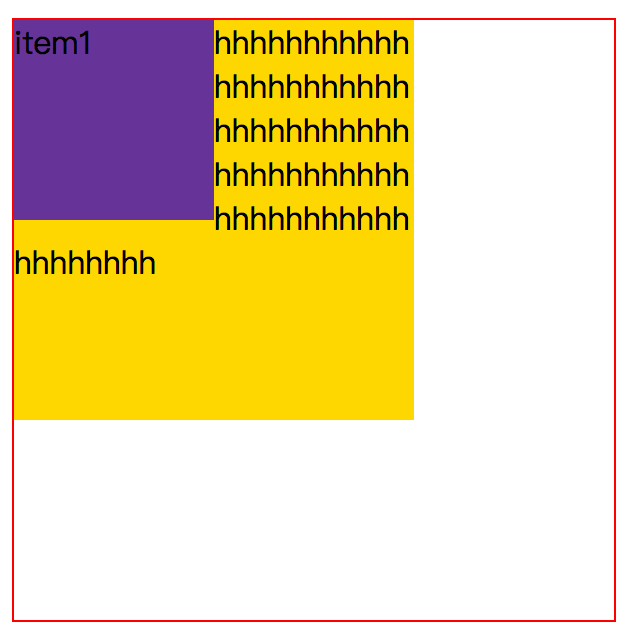

# CSS布局

CSS有三种基本的定位机制：普通流，浮动和绝对定位。

* 普通流

普通流是默认定位方式，在普通流中元素框的位置由元素在html中的位置决定，元素position属性为static或继承来的static时就会按照普通流定位，这也是我们最常见的方式。

* 相对定位

相对定位比较简单，对应position属性的relative值，如果对一个元素进行相对定位，它将出现在他所在的位置上，然后可以通过设置垂直或水平位置，让这个元素相对于它自己移动，**在使用相对定位时，无论元素是否移动，元素在文档流中占据原来空间，只是表现会改变。**

* 绝对定位

  相对定位可以看作特殊的普通流定位，元素位置是相对于他在普通流中位置发生变化，**而绝对定位使元素的位置与文档流无关，也不占据文档流空间，普通流中的元素布局就像绝对定位元素不存在一样。**

  **绝对定位的元素的位置是相对于距离他最近的非static祖先元素位置决定的。** 如果元素没有已定位的祖先元素，那么他的位置就相对于初始包含块儿（body或html神马的）元素。

  因为绝对定位与文档流无关，所以绝对定位的元素可以覆盖页面上的其他元素，可以通过z-index属性控制叠放顺序，z-index越高，元素位置越靠上。

    * 固定定位

    fixed属性了，应用fixed也叫固定定位，固定定位是绝对定位的中，**固定定位的元素也不包含在普通文档流中。**

* 浮动布局

首先介绍一些浮动模型的基本知识：浮动模型也是一种可视化格式模型，浮动的框可以左右移动（根据float属性值而定），直到它的外边缘碰到包含框或者另一个浮动元素的框的边缘。**浮动元素不在文档的普通流中，文档的普通流中的元素表现的就像浮动元素不存在一样.**

下面看几个例子：

  * 不浮动
  * 红块向右移动
  * 红块向左移动，绿块被覆盖
  * 都向左浮动，父元素宽度为0
  * 卡住的情况

  * 行框和清理

    前面指出浮动会让元素脱离文档流,不影响不浮动元素.实际上并不完全如此,如果浮动的元素后面有一个文档流中元素,那么这个元素的框会表现的像浮动元素不存在,**但是框的<u>文本内容</u>会受到浮动元素的影响,会移动以留出空间.用术语说就是浮动元素旁边的行框被缩短,从而给浮动元素流出空间,因而行框围绕浮动框。**

    eg:

    ```html
    <div class="container2">
      <div class="item1">item1</div>
      <div class="item2">hhhhhhhhhhhhhhhhhhhhhhhhhhhhhhhhhhhhhhhhhhhhhhhhhhhhhhhhhhhhhhh</div>
    </div>

    <style>
    .container2 {
      margin-top: 30px;
      height: 300px;
      width: 300px;
      border: 1px solid red;
    }
    .item1 {
      float: left;
      height: 100px;
      width: 100px;
      background-color: rebeccapurple;
    }
    .item2 {
      height: 200px;
      width: 200px;
      background-color: gold;
      word-wrap: break-word;
    }
    </style>
    ```

    

    >文本内容会收到影响。
    > 可以看出浮动后虽然黄色div布局不受浮动影响，正常布局，但是文字部分却被挤到了紫色浮动div下边。要想阻止行框围绕在浮动元素外边，可以使用clear属性，属性的left，right，both，none表示框的哪些边不挨着浮动框。

    > 在`item2`的样式中添加`clear:both;`就可以解决这个问题了。

* 参考文档

  * [CSS布局 ——从display，position， float属性谈起](http://www.cnblogs.com/dolphinX/archive/2012/10/13/2722501.html)